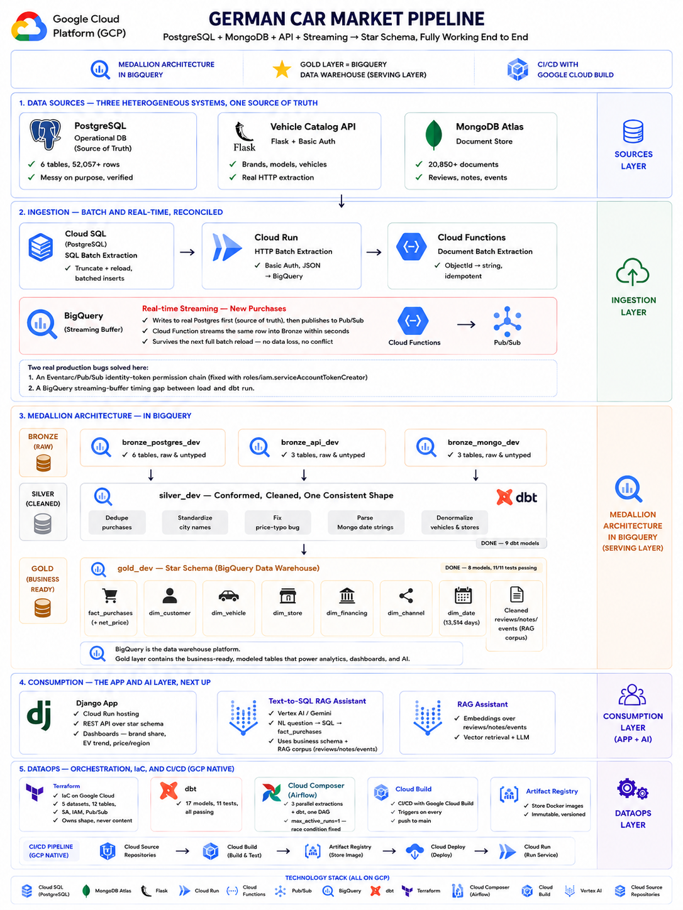
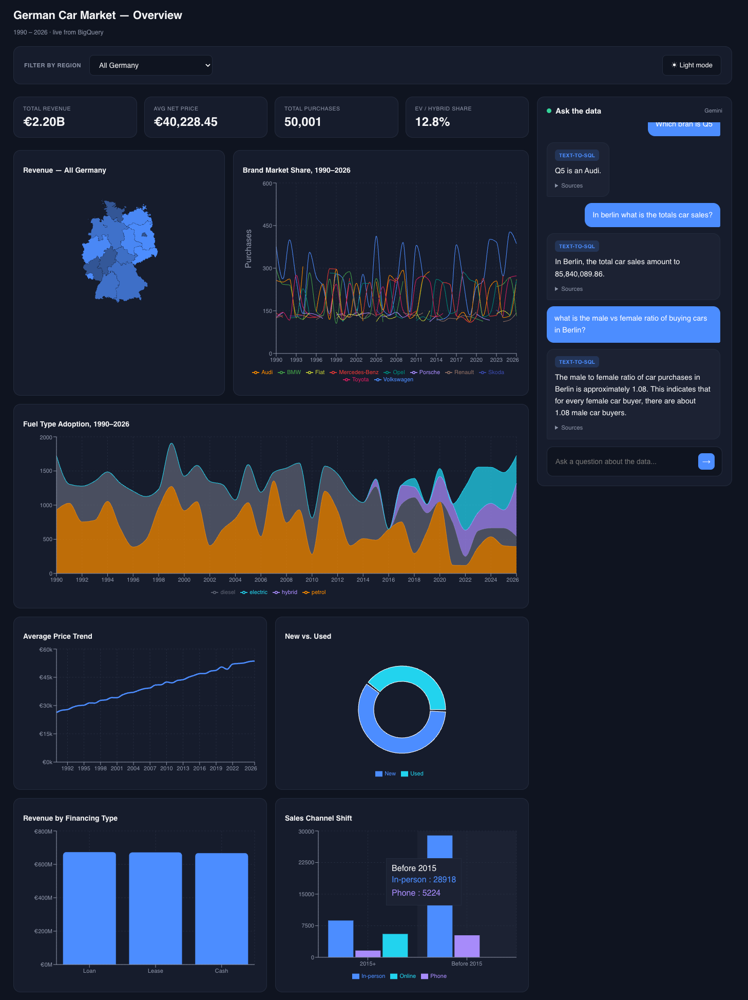

# German Car Market Data Platform

A complete, real, end-to-end data engineering platform simulating the German car market, 1990–2026: three genuinely heterogeneous data sources feeding a medallion architecture and star schema, a full batch + real-time streaming pipeline, an interactive BI dashboard, and a working RAG + text-to-SQL AI assistant.

Everything in this README documents what was actually built, in the actual order it was built, including every real bug hit and how it was fixed — not a cleaned-up retrospective.



## What this project demonstrates

- Medallion architecture (Bronze/Silver/Gold) across **three different source systems** — a relational database, a REST API, and a document database
- A **star schema** (fact + dimension tables) built with dbt, fully tested
- **Batch and real-time streaming** ingestion, correctly reconciled to a single source of truth
- **Infrastructure as code** (Terraform), **orchestration** (Airflow in Docker), and **CI/CD** (Google Cloud Build)
- A **Django + React BI dashboard** with a live choropleth map, drill-down filtering, and a light/dark theme
- A working **RAG + text-to-SQL assistant** (Vertex AI, Gemini, BigQuery's native vector search) with a real chat interface

---

## Architecture overview

```
SOURCES                          INGESTION                      MEDALLION
┌─────────────┐
│ PostgreSQL  │──batch──┐
│ (operational)│        │
└─────────────┘        │
┌─────────────┐        ├──▶  Bronze  ──▶  Silver  ──▶  Gold (star schema)
│ Flask API   │──batch──┤    (raw,        (cleaned,     (fact_purchases +
│ (vehicles)  │        │     per-source)  conformed)     6 dimensions)
└─────────────┘        │
┌─────────────┐        │
│ MongoDB     │──batch──┘
│ (reviews)   │
└─────────────┘
┌─────────────┐
│ Simulated   │──stream─▶ Pub/Sub ──▶ Cloud Function ──▶ Bronze (append)
│ new sale    │           (writes to real Postgres first, then streams)
└─────────────┘

                              CONSUMPTION
Gold ──▶ Django REST API ──▶ React Dashboard (map, charts, filters)
     └─▶ embedded_documents ──▶ RAG + Text-to-SQL chat assistant (Gemini)

                              DATAOPS
Terraform (infra) · dbt (transform + tests) · Airflow (orchestration)
Cloud Build (CI/CD) · Git/GitHub (version control)
```

---

## Project folder structure

```text
german_car_market/
├── .env                              - all local secrets (not committed)
├── .gitignore
├── README.md
├── schema.sql                        - PostgreSQL DDL for all 9 tables
├── generate_postgres_data.py         - generates the messy PostgreSQL source data
├── generate_mongo_data.py            - generates MongoDB reviews/notes/events
├── vehicle_catalog_api.py            - Flask API simulating an external vehicle-spec source
├── extract_postgres_to_bronze.py
├── extract_api_to_bronze.py
├── extract_mongo_to_bronze.py
├── simulate_new_purchase.py           - simulates a real-time sale (Postgres + Pub/Sub)
├── generate_embeddings.py             - embeds review/note/event text into BigQuery
├── docker-compose.yml                 - Postgres (Airflow metadata), webserver, scheduler
├── cloudbuild.yaml                    - Cloud Build CI/CD config
│
├── docs/
│   ├── Architecture.png               - full end-to-end platform architecture diagram
│   └── RAG_App.png                    - screenshot of the working RAG chat assistant
│
├── keys/
│   └── car_pipeline_service_account.json   - GCP service account key (not committed)
│
├── schemas/                           - 12 Bronze table schema definitions (JSON)
│
├── terraform/
│   ├── main.tf                        - all GCP resources
│   ├── variables.tf
│   ├── outputs.tf
│   └── terraform.tfvars               - real project_id (not committed)
│
├── dbt/
│   ├── dbt_project.yml
│   ├── profiles.yml                   - BigQuery connection (not committed)
│   ├── models/
│   │   ├── sources.yml                - declares all 12 Bronze tables across 3 datasets
│   │   ├── silver/                    - 9 models
│   │   └── gold/                      - 8 models + schema.yml (11 tests)
│   └── macros/
│       └── generate_schema_name.sql
│
├── airflow/
│   ├── Dockerfile
│   └── dags/
│       └── car_market_pipeline_dag.py
│
├── cloud_functions/
│   └── new_purchase_handler/
│       ├── main.py                    - Gen2 Cloud Function, Pub/Sub-triggered
│       └── requirements.txt
│
├── django_app/
│   ├── manage.py
│   ├── car_market_api/
│   │   ├── settings.py
│   │   └── urls.py
│   └── dashboard/
│       ├── views.py                   - 9 API endpoints + RAG/text-to-SQL logic
│       ├── urls.py
│       └── bigquery_client.py
│
└── react_app/
    ├── public/
    │   └── germany-states.json         - German Bundesländer GeoJSON
    └── src/
        ├── App.js / App.css
        ├── KpiCards.js
        ├── GermanyRevenueMap.js
        ├── BrandMarketShareChart.js
        ├── FuelTypeTrendChart.js
        ├── PriceTrendChart.js
        ├── NewVsUsedChart.js
        ├── FinancingChart.js
        ├── ChannelShiftChart.js
        ├── RegionSelector.js
        └── ChatPanel.js
```

---

## The full process, in the order it was actually built

### Part 0 — Tooling setup (Mac, Apple Silicon)

```bash
# Homebrew — package manager, makes everything below a one-line install
/bin/bash -c "$(curl -fsSL https://raw.githubusercontent.com/Homebrew/install/HEAD/install.sh)"

# Python 3.12 specifically — dbt-core does not support the very latest Python versions
brew install python@3.12

# Node.js (for React)
brew install node

# Terraform — moved off Homebrew's core formulae due to licensing; use HashiCorp's own tap
brew tap hashicorp/tap
brew install hashicorp/tap/terraform

# Google Cloud SDK
brew install --cask google-cloud-sdk

# Docker Desktop — install from docker.com

# PostgreSQL 18 — installed via the EnterpriseDB installer (includes pgAdmin)
# MongoDB Compass — GUI client for MongoDB Atlas
brew install --cask mongodb-compass
```

**Verify everything:**
```bash
python3.12 --version
node --version && npm --version
terraform --version
gcloud --version
docker --version
```

### Part 1 — PostgreSQL: the operational source

Created database `german_car_market`, then all 9 tables via `schema.sql` (regions, financing_types, sales_channels, brands, models, vehicles, customers, stores, purchases — all with `IF NOT EXISTS` for safe re-runs and proper foreign keys).

```bash
python3.12 -m venv venv
source venv/bin/activate
pip install psycopg2-binary python-dotenv pymongo faker flask google-cloud-bigquery requests
```

`generate_postgres_data.py` generates 16 regions, 10 brands, 17 models, ~380 vehicle configs (with real historical logic: fuel type shifts from petrol/diesel toward EV/hybrid after ~2015, transmission moves from manual to automatic over time, emissions classes step through Euro 1–6 at their real introduction dates, `NULL` before 1992 since standards didn't exist), 8,000 customers, ~50 stores, and 52,000+ purchases — with deliberate messiness: ~4% duplicate transactions, ~10% missing income, ~8% missing occupation, inconsistent city spellings (Munich/München/Muenchen), and a ~2% price decimal-shift typo bug.

```bash
python generate_postgres_data.py
```

**Real issue solved**: re-running this script duplicated all data, since `INSERT` has no `IF NOT EXISTS` equivalent. Fixed by adding a `TRUNCATE TABLE ... RESTART IDENTITY CASCADE` safeguard at the top of the script during development.

### Part 2 — Vehicle Catalog API (simulating an external source)

`vehicle_catalog_api.py` — a Flask app with HTTP Basic Auth, serving `brands`/`models`/`vehicles` on port 5001, backed by the same PostgreSQL data.

```bash
python vehicle_catalog_api.py
```

**Real issue solved**: macOS reserves port 5000 for AirPlay Receiver — used port 5001 instead.

### Part 3 — MongoDB Atlas: unstructured text source

Free-tier cluster on Google Cloud infrastructure (region: Belgium/western-europe). Three collections: `customer_reviews`, `dealer_notes`, `market_events` (4 curated, real historical events: 2008 financial crisis, 2015 Dieselgate, 2020 COVID, 2023 EV subsidy cuts).

`generate_mongo_data.py` reads real `purchase_id`s from Postgres and generates ~13,000 reviews and ~7,800 dealer notes referencing them, with realistic sentiment distribution and a ~10% missing-rating rate.

```bash
python generate_mongo_data.py
```

**Real issue solved**: MongoDB passwords containing special characters (`@`, etc.) break connection URIs — fixed with `urllib.parse.quote_plus()` on both username and password before building the connection string.

### Part 4 — GCP infrastructure (Terraform)

```bash
gcloud auth login
gcloud auth application-default login
gcloud config set project german-car-pipeline
gcloud services enable bigquery.googleapis.com storage.googleapis.com pubsub.googleapis.com cloudfunctions.googleapis.com run.googleapis.com aiplatform.googleapis.com
```

`terraform/main.tf` provisions:
- **5 BigQuery datasets**: `bronze_postgres_dev`, `bronze_api_dev`, `bronze_mongo_dev` (deliberately separate per source, so a bad load never crosses sources), `silver_dev`, `gold_dev`
- **12 Bronze tables** via a `for_each` loop over a `locals` map (one Terraform block instead of 12 near-identical ones)
- A service account (`car-pipeline-dev`) with least-privilege roles: `bigquery.jobUser`, `bigquery.dataEditor`, `pubsub.publisher`, `aiplatform.user`, `bigquery.connectionUser`
- A Pub/Sub topic (`new-purchase-dev`) for streaming

```bash
cd terraform
terraform init
terraform plan
terraform apply
```

Extract the service account key:
```bash
terraform output -raw pipeline_sa_key_base64 | base64 --decode > ../keys/car_pipeline_service_account.json
```

**Real issue solved**: `.gitignore` entries got merged onto one corrupted line mid-session (`echo >>` without a preceding newline) — always verify with `git check-ignore -v <file>` after editing `.gitignore`, don't just trust it saved.

### Part 5 — Extraction scripts (batch)

Three scripts, three genuinely different access patterns, all idempotent (`TRUNCATE` before reload):

```bash
python extract_postgres_to_bronze.py   # psycopg2, batched inserts (5,000 rows/batch)
python extract_api_to_bronze.py        # requests + HTTP Basic Auth
python extract_mongo_to_bronze.py      # pymongo, converts ObjectId → string
```

**Real issue solved**: `insert_rows_json` (BigQuery's streaming insert) has a real ~10MB payload limit — hit a `413 Request Entity Too Large` loading 50,000+ purchase rows in one call. Fixed by batching every large insert (5,000 rows/batch for simple data, 500 rows/batch for embedding vectors later, since each embedding is a 768-value array and far larger per row).

### Part 6 — dbt (Silver + Gold star schema)

```bash
pip install dbt-bigquery
cd dbt
dbt debug
```

**Silver (9 models)**: `silver_customers` (standardizes messy city names via `CASE WHEN`), `silver_vehicles` (joins brands+models+vehicles), `silver_purchases` (deduplicates via `ROW_NUMBER() OVER (PARTITION BY customer_id, vehicle_id, purchase_date, price)`, fixes the price-typo bug with `CASE WHEN price < 1000 THEN price * 10`, floors negative discounts to 0), `silver_regions`, `silver_financing_types`, `silver_sales_channels`, `silver_stores` (denormalizes region_name in), `silver_customer_reviews`, `silver_dealer_notes`, `silver_market_events` (all three parse MongoDB's string dates with `PARSE_DATE`).

**Gold (8 models, the actual star schema)**: `fact_purchases` (adds calculated `net_price = price - discount_applied - trade_in_value`), `dim_customer`, `dim_vehicle`, `dim_store`, `dim_financing`, `dim_channel`, and `dim_date` (generated purely from a date range via `GENERATE_ARRAY`/`UNNEST`, not from any source — 13,514 rows spanning 1990–2026), plus `schema.yml` with 11 dbt tests (`unique`/`not_null` on every key).

```bash
dbt run --select "silver.*" "gold.*"
dbt test
```

**Real issue solved**: zsh interprets unquoted wildcards as filename globs — `dbt run --select silver.*` fails with "no matches found"; must quote it: `--select "silver.*"`.

### Part 7 — Airflow orchestration (Docker)

```bash
docker compose build
docker compose up airflow-init
docker compose up -d
```

One DAG (`german_car_market_pipeline`): 3 extraction tasks run **in parallel** (`[extract_postgres, extract_mongo, extract_api] >> dbt_run_silver >> dbt_run_gold >> dbt_test`), scheduled `@daily`.

**Real issue solved (a genuine production-grade bug)**: unpausing the DAG triggered *both* a manual run and an automatic catch-up scheduled run simultaneously — both ran the same "truncate, then reload" extraction scripts concurrently and **doubled every Bronze table** (customers went 8,000 → 16,000). Diagnosed by checking the DAG run history and seeing two overlapping runs. Fixed with `max_active_runs=1` in the DAG definition, and confirmed fixed by re-running cleanly and verifying row counts returned to normal.

Also required `host.docker.internal` (not `localhost`) for `PG_HOST`/`API_HOST` env vars, since containers can't reach the host machine via `localhost`.

### Part 8 — Real-time streaming (Pub/Sub + Cloud Functions)

```bash
gcloud functions deploy handle-new-purchase \
  --gen2 --runtime=python312 --region=europe-west3 --source=. \
  --entry-point=handle_new_purchase --trigger-topic=new-purchase-dev \
  --service-account=car-pipeline-dev@german-car-pipeline.iam.gserviceaccount.com \
  --set-env-vars=GCP_PROJECT_ID=german-car-pipeline
```

**Real issue solved (a genuine multi-layer IAM chain)**: the function returned repeated 403 "unauthenticated" errors. Granting `roles/run.invoker` to the default compute service account did *not* fix it — `gcloud eventarc triggers describe` revealed the trigger actually authenticates as `car-pipeline-dev@...`. Granting *that* account `run.invoker` still failed. The real missing piece: Pub/Sub's own internal service agent needed `roles/iam.serviceAccountTokenCreator` **on** `car-pipeline-dev`, so it could mint a valid identity token asserting that account. Once fixed, Pub/Sub's automatic retry mechanism delivered all previously-failed backlogged messages successfully.

**Real issue solved (architectural)**: the streaming simulator originally wrote *only* to BigQuery with a fake random `purchase_id`, meaning the next full batch reload (which truncates-and-reloads from real Postgres) would silently **wipe out** the streamed row, since it never existed in the actual source of truth. Fixed by rewriting `simulate_new_purchase.py` to insert into real PostgreSQL first (getting a genuine sequential ID via `RETURNING purchase_id`), *then* publish that same ID to Pub/Sub — making Postgres the single source of truth for both paths.

```bash
python simulate_new_purchase.py
```

### Part 9 — CI/CD (Google Cloud Build)

Chosen over GitHub Actions to stay fully GCP-native.

```bash
gcloud services enable cloudbuild.googleapis.com
bq mk --connection --location=europe-west3 --connection_type=CLOUD_RESOURCE vertex-ai-connection
```

`cloudbuild.yaml`: two steps, `terraform-validate` (`init -backend=false` + `validate`) and `dbt-parse`.

**Real issue solved**: `dbt parse` failed in the Cloud Build container because `profiles.yml` is correctly gitignored (real credentials), so it doesn't exist there. Fixed by generating a throwaway stub `profiles.yml` inline in the build step — safe because `dbt parse` is pure static analysis and never actually connects to BigQuery.

Trigger `validate-on-push` watches `main`, connected via the "Google Cloud Build" GitHub App.

### Part 10 — Django REST API backend

```bash
mkdir django_app && cd django_app
pip install django djangorestframework django-cors-headers
django-admin startproject car_market_api .
python manage.py startapp dashboard
python manage.py migrate
python manage.py runserver
```

9 endpoints over `gold_dev`, every one accepting an optional `?region=<Bundesland>` filter via a shared `region_filter_clause()` helper: `brand-market-share`, `kpi-summary`, `revenue-by-region`, `revenue-by-financing`, `channel-shift`, `fuel-type-trend`, `price-trend`, `new-vs-used`, and `ask` (the RAG/text-to-SQL endpoint).

**Real issue solved**: a circular `urls.py` import — `dashboard/urls.py` accidentally contained `car_market_api/urls.py`'s own content (including `include('dashboard.urls')` pointing at itself), causing infinite recursion in Django's URL resolver. Fixed by replacing each file with its correct, distinct content and verifying with `cat` before moving on.

**Real issue solved**: the BigQuery credentials path needed **two** `../..` (not one) to get from `dashboard/` through `django_app/` to the actual project root where `keys/` lives.

### Part 11 — React dashboard

```bash
npx create-react-app react_app
cd react_app
npm install recharts axios react-simple-maps d3-geo d3-scale --legacy-peer-deps
```

**Real issue solved**: `react-simple-maps` only officially declares support for React 16–18, but this project's fresh `create-react-app` install got React 19 by default, causing an `ERESOLVE` dependency conflict. Resolved with `--legacy-peer-deps` — a deliberate, informed override, not a blind one, since the library's actual SVG rendering has no real React-19 incompatibility.

Downloaded real German Bundesländer boundaries:
```bash
curl -o public/germany-states.json https://raw.githubusercontent.com/isellsoap/deutschlandGeoJSON/main/2_bundeslaender/4_niedrig.geo.json
```

**Real issue solved**: the GeoJSON uses **German** state names (Bayern, Hessen, Niedersachsen, Nordrhein-Westfalen, Rheinland-Pfalz, Sachsen-Anhalt, Sachsen, Thüringen) while the API returns **English** names — only 8 of 16 states rendered with color at first. Fixed with a `GERMAN_TO_ENGLISH` translation dictionary inside `GermanyRevenueMap.js`.

Components: `KpiCards`, `GermanyRevenueMap` (click-to-zoom via `d3.geoCentroid`, synced two-way with a dropdown), `BrandMarketShareChart`, `FuelTypeTrendChart` (stacked area, showing the real historical fuel-type shift), `PriceTrendChart`, `NewVsUsedChart`, `FinancingChart`, `ChannelShiftChart`, `RegionSelector`. All support region filtering and a light/dark theme via a shared `theme` prop and CSS custom properties.

```bash
npm start
```

### Part 12 — RAG + text-to-SQL assistant

```bash
gcloud projects add-iam-policy-binding german-car-pipeline \
  --member="serviceAccount:car-pipeline-dev@german-car-pipeline.iam.gserviceaccount.com" \
  --role="roles/aiplatform.user"
pip install google-genai
```

`generate_embeddings.py` embeds all ~20,850 rows from `silver_customer_reviews`, `silver_dealer_notes`, `silver_market_events` using Vertex AI's `text-embedding-005` (768 dimensions), storing them in `gold_dev.embedded_documents`.

```bash
python generate_embeddings.py
```

**Real issue solved**: the initial permission error (`403 aiplatform.endpoints.predict`) required granting `roles/aiplatform.user` to the service account (also added properly to Terraform, not just the CLI).

**Real issue solved**: a `503 Service Unavailable` transient timeout mid-run — fixed by wrapping the embedding call in a retry decorator (`tenacity`, exponential backoff, 4 attempts).

**Real issue solved**: `insert_rows_json` (streaming insert) hit both the payload-size limit *and* a `400 ... would affect rows in the streaming buffer` error when trying to `DELETE` between sources. Fixed by switching to `load_table_from_json` (a true batch load), which has no streaming buffer and no size-based DML restrictions.

**BigQuery ML remote model setup** (for calling Vertex AI directly from SQL):
```bash
bq mk --connection --location=europe-west3 --connection_type=CLOUD_RESOURCE vertex-ai-connection
bq show --connection --location=europe-west3 vertex-ai-connection   # get the connection's service account email
gcloud projects add-iam-policy-binding german-car-pipeline \
  --member="serviceAccount:<connection-service-account>" --role="roles/aiplatform.user"
```
```sql
CREATE OR REPLACE MODEL `german-car-pipeline.gold_dev.embedding_model`
REMOTE WITH CONNECTION `german-car-pipeline.europe-west3.vertex-ai-connection`
OPTIONS (ENDPOINT = 'text-embedding-005')
```

**Real issue solved**: the connection's own service account also needed `roles/bigquery.connectionUser` granted separately to the Django service account, distinct from `aiplatform.user`, before `VECTOR_SEARCH` queries could actually execute.

Verified retrieval with a real test query (`VECTOR_SEARCH` against a "Why did diesel sales decline?" embedding) — correctly returned the Dieselgate `market_events` entry as the #1 result by a meaningful distance margin, real proof of working semantic search.

**Django `/api/ask/` endpoint** (`dashboard/views.py`): a router (`classify_question`) uses Gemini to classify each question as SQL or RAG, then:
- **SQL path**: Gemini writes a real BigQuery SELECT query against the star schema, checked for safety (`is_safe_select` — blocks any non-SELECT statement), executed, and the result phrased in plain language
- **RAG path**: the question is embedded on the fly via `VECTOR_SEARCH`, the 5 closest documents retrieved, and Gemini phrases a grounded answer from that context only

**Real issue solved (model deprecation)**: `gemini-2.0-flash` returned a `404 Publisher model ... was not found` in every region tried (europe-west3, us-central1, global) — the model had genuinely been shut down by Google since the code was first written. Diagnosed via web search rather than endless region-guessing, then fixed by switching to the currently-active `gemini-2.5-flash`, and migrating from the older `vertexai.generative_models` SDK to the current `google-genai` SDK (`genai.Client(vertexai=True, ...)`).

**Real issue solved (prompt engineering)**: Gemini-generated SQL twice failed in realistic ways — once omitting backticks around the hyphenated project ID (`Unrecognized name: german`, since unbacked identifiers get parsed as arithmetic), fixed by giving Gemini an explicit correct/incorrect example in the prompt; and once filtering on the wrong column (`city = 'Bremen'` instead of `region_name = 'Bremen'`), fixed by adding an explicit note to the schema description clarifying which column holds Bundesland names.

### Part 13 — React chat panel

`ChatPanel.js` — a stateful chat component (`messages` array grows over time), calling `POST /api/ask/`, rendering each answer with a colored tag (`Text-to-SQL` in blue, `RAG` in purple) and a collapsible "Sources" section for transparency.

**Real issue solved**: `scrollIntoView()` was scrolling the entire page, not just the chat's own message list — fixed by directly setting `container.scrollTop = container.scrollHeight` on a ref to the message container instead.



---

## Full setup — reproducing this from scratch

1. Install: Homebrew, Python 3.12, Node.js, Terraform, gcloud SDK, Docker Desktop, PostgreSQL 18 (+ pgAdmin), MongoDB Compass
2. `python3.12 -m venv venv && source venv/bin/activate && pip install psycopg2-binary python-dotenv pymongo faker flask google-cloud-bigquery requests dbt-bigquery google-cloud-aiplatform google-genai`
3. Create the PostgreSQL database and run `schema.sql`
4. Create `.env` with `DB_PASSWORD`, `MONGO_USERNAME`, `MONGO_PASSWORD`, `CATALOG_API_USER`, `CATALOG_API_PASS`, `GOOGLE_APPLICATION_CREDENTIALS`, `GCP_PROJECT_ID`
5. `python generate_postgres_data.py`
6. Set up MongoDB Atlas (free tier, GCP region), then `python generate_mongo_data.py`
7. `cd terraform && terraform init && terraform apply`, then extract the service account key
8. Run all three extraction scripts (with `vehicle_catalog_api.py` running in a separate terminal)
9. `cd dbt && dbt run && dbt test`
10. `docker compose build && docker compose up airflow-init && docker compose up -d` — trigger the DAG at `localhost:8080`
11. Deploy the Cloud Function, connect Cloud Build's GitHub trigger
12. `cd django_app && python manage.py migrate && python manage.py runserver`
13. `cd react_app && npm install --legacy-peer-deps && npm start` — open `localhost:3000`
14. `python generate_embeddings.py`, create the BigQuery ML remote model, grant all IAM roles listed above
15. Ask the chat assistant a question

### Cleaning up
```bash
docker compose down -v
cd terraform && terraform destroy
```

---

## Complete technology stack

| Layer | Tools |
|---|---|
| Sources | PostgreSQL, Flask, MongoDB Atlas |
| Ingestion | psycopg2, requests, pymongo, Pub/Sub, Cloud Functions |
| Warehouse | BigQuery |
| Transformation | dbt |
| Infrastructure | Terraform |
| Orchestration | Airflow (Docker) |
| CI/CD | Google Cloud Build |
| Backend | Django, Django REST Framework |
| Frontend | React, Recharts, react-simple-maps, Axios |
| AI | Vertex AI, Gemini 2.5 Flash, `text-embedding-005`, BigQuery `VECTOR_SEARCH` |
| Version control | Git, GitHub |

## What's next

- A fourth source (Azure SQL / MSSQL), with incremental/watermark-based loading — designed conceptually, not yet built
- Deploying the Django + React app to Cloud Run for a real public demo
